# Smarterise IoT Energy Monitoring Platform

## Introduction

Smarterise operates an IoT-based energy monitoring platform that collects high-frequency readings from smart meters deployed at transformer sites across Lagos. Meters transmit structured data payloads via FTP and MQTT every few minutes, containing three-phase voltage, current, power factor, frequency, and site identifiers. The platform is live and serves real clients, with its data feeding both a QuickSight analytics dashboard and a customer-facing web application via Aurora PostgreSQL.

This repository contains the complete infrastructure-as-code, Lambda processing logic, database schema, and operational documentation for the redesigned pipeline. The solution addresses the strain the existing architecture shows as the platform scales from its current footprint toward several hundred active sites - specifically around ingestion throughput, query performance under concurrent dashboard load, and data model rigidity caused by managing site-to-meter mappings in application code rather than the database.

The redesigned pipeline introduces two parallel ingestion paths that converge at a single Aurora Serverless v2 writer: a file-based FTP path buffered through SQS, and a real-time MQTT path through AWS IoT Core and Kinesis Data Streams. Both paths share identical normalisation, deduplication, and bulk-insert logic implemented in Python Lambda functions, deployed inside a private VPC subnet with no public internet exposure.

---

> ### ⚠️ Important Notice - Streaming Path (Kinesis / IoT Core) Not Deployed
>
> The architecture designed and documented in this repository covers **two ingestion paths**: a batch path (FTP → S3 → SQS → Lambda) and a real-time streaming path (MQTT → IoT Core → Kinesis → Lambda).
>
> **Only the batch path was fully deployed and tested end-to-end.**
>
> The streaming path, specifically AWS IoT Core and Amazon Kinesis Data Streams was **not deployed** for the following reasons:
>
> - **No AWS Free Tier coverage.** Neither AWS IoT Core nor Amazon Kinesis Data Streams are included in the AWS Free Tier. Provisioning and running these services, even at minimal scale, incurs immediate hourly and per-message costs that were not viable for this implementation exercise.
> - **No IAM credentials were provided** for the AWS account that would be used to deploy these services, which made it impossible to provision them within the scope of this submission.
>
> Despite these constraints, the following was still delivered for the streaming path:
>
> - ✅ **Full Terraform module** (`modules/kinesis/main.tf`) - defines the Kinesis Data Stream, shard-level CloudWatch metrics, KMS encryption, and iterator age alarm. The module is complete and production-ready.
> - ✅ **Full IAM role and policy** for the stream Lambda - scoped to the specific Kinesis stream ARN with least-privilege permissions.
> - ✅ **`stream_processor.py`** - the complete Kinesis-triggered Lambda handler, including base64 decoding, JSON parsing, timestamp normalisation, deduplication, and bulk Aurora insert with per-record failure reporting.
> - ✅ **Terraform wiring** in `main.tf` - the `module "kinesis"` and `module "lambda"` blocks that connect IoT Core → Kinesis → Lambda are present but **commented out**, clearly marked so they can be enabled with a single `terraform apply` once the appropriate AWS account and credentials are available.
>
> The batch path was implemented and tested in full, and some personal AWS costs were incurred to do so (Aurora Serverless v2, NAT Gateway, VPC Interface Endpoints).

---

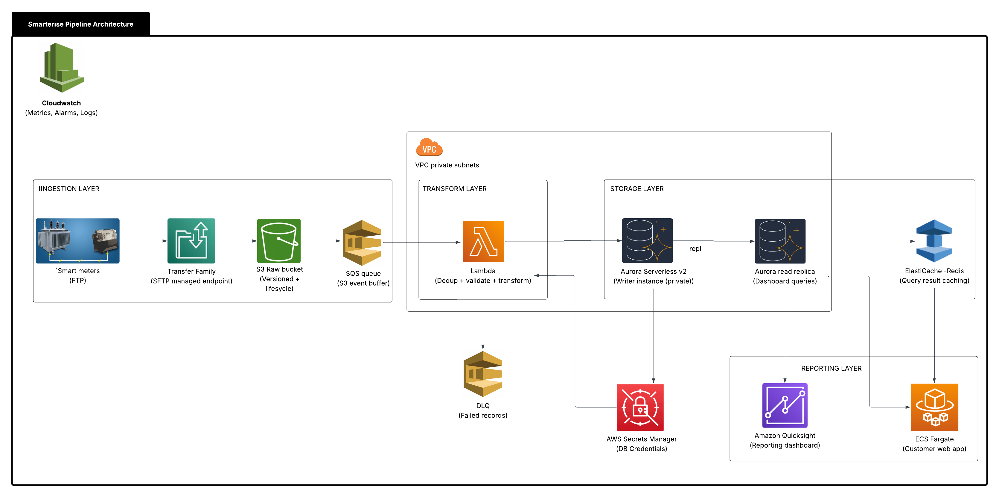

---

## Table of Contents

1. [Reproducibility - Getting the Pipeline Running](#1-reproducibility--getting-the-pipeline-running)
2. [Solution Overview](#2-solution-overview) *(next section)*

---

## 1. Reproducibility - Getting the Pipeline Running

This section is a walkthrough for deploying the pipeline from scratch into a new AWS account or environment. The steps should be followed in sequence - each section depends on the one before it.

---

### 1.1 Prerequisites

Ensure the following tools are installed and configured on your local machine before starting.

| Tool | Minimum version | Check |
|---|---|---|
| [Terraform](https://developer.hashicorp.com/terraform/install) | 1.6.0 | `terraform -version` |
| [AWS CLI](https://docs.aws.amazon.com/cli/latest/userguide/getting-started-install.html) | 2.x | `aws --version` |
| [Python](https://www.python.org/downloads/) | 3.12 | `python3 --version` |
| [pip](https://pip.pypa.io/en/stable/installation/) | any | `pip --version` |
| [zip](https://linux.die.net/man/1/zip) | any | `zip --version` |

The AWS CLI must be authenticated and pointed at the correct account and region:

```bash
aws configure
# or, if using SSO:
aws sso login --profile your-profile-name

# verify the identity that will be creating resources
aws sts get-caller-identity
```

The IAM user or role running Terraform needs broad permissions to create VPCs, Lambda functions, RDS clusters, SQS queues, Kinesis streams, IAM roles, S3 buckets, CloudWatch alarms, and Secrets Manager secrets. In a fresh account, `AdministratorAccess` is the simplest starting point; in a locked-down account, scope the policy to the specific services listed above.

---

### 1.2 Clone the Repository

```bash
git clone https://github.com/your-org/smarterise-solution.git
cd smarterise-terraform
```

The repository structure is as follows:

```
smarterise-terraform/
├── main.tf                          # Root module - wires all modules together
├── variables.tf                     # Root variable declarations and defaults
├── environments/
│   └── dev/
│       └── terraform.tfvars         # Dev environment overrides
├── modules/
│   ├── vpc/main.tf                  # VPC, subnets, NAT gateways, VPC endpoints
│   ├── s3/main.tf                   # Raw and processed S3 buckets
│   ├── sqs/main.tf                  # Main queue + dead-letter queue
│   ├── kinesis/main.tf              # Kinesis Data Stream
│   ├── iam/main.tf                  # IAM roles and least-privilege policies
│   ├── aurora/main.tf               # Aurora Serverless v2 cluster + instances
│   └── lambda/main.tf               # Both Lambda functions + event source mappings
├── lambda/
│   ├── batch_processor.py           # SQS-triggered Lambda (FTP path)
│   └── stream_processor.py          # Kinesis-triggered Lambda (MQTT path)
└── sql/
    └── schema.sql                   # Database DDL - tables, indexes, views, pg_cron jobs
```

---

### 1.3 Package the Lambda Functions

Terraform deploys Lambda code from a local `.zip` file. The zip must include both Python handler files and all third-party dependencies (`psycopg2-binary`, `boto3`).

```bash
# create a fresh build directory
mkdir -p lambda_build

# install dependencies directly into the build directory
# psycopg2-binary: PostgreSQL driver
# boto3 is included in the Lambda runtime but pinning it avoids version surprises
pip install \
  psycopg2-binary \
  boto3 \
  --target ./lambda_build \
  --platform manylinux2014_x86_64 \
  --implementation cp \
  --python-version 3.12 \
  --only-binary=:all: \
  --upgrade

# copy the handler files into the build directory
cp lambda/batch_processor.py  ./lambda_build/
cp lambda/stream_processor.py ./lambda_build/

# zip everything - the zip must be flat (handlers at root level)
cd lambda_build
zip -r ../lambda_package.zip .
cd ..

# confirm the handlers are at the root of the zip (not inside a subdirectory)
unzip -l lambda_package.zip | grep "_processor.py"
```

Expected output of the last command:

```
    ...  batch_processor.py
    ...  stream_processor.py
```

If the paths show a subdirectory prefix (e.g. `lambda_build/batch_processor.py`), Lambda will fail with a handler not found error. Re-zip from inside the `lambda_build/` directory as shown above.

> **Note on psycopg2:** The `--platform manylinux2014_x86_64` flag forces pip to download the Linux-compatible binary wheel regardless of your local OS. This is required because Lambda runs on Amazon Linux 2 - a `.dylib` compiled on macOS will not load.

---

### 1.4 Enable pg_cron in the Aurora Parameter Group

The schema uses `pg_cron` to automatically create and drop monthly partitions on a schedule. Aurora PostgreSQL requires `pg_cron` to be declared in `shared_preload_libraries` at the cluster parameter group level before the extension can be created.

In `modules/aurora/main.tf`, confirm the following parameter exists inside `aws_rds_cluster_parameter_group`:

```hcl
parameter {
  name         = "shared_preload_libraries"
  value        = "pg_cron"
  apply_method = "pending-reboot"
}
```

This is already present in the module. If you are deploying to an existing cluster that was provisioned without this parameter, you must add it and reboot the writer instance once before running the schema script. A fresh deployment (first `terraform apply`) does not require a manual reboot - the cluster starts with the parameter already set.

---

### 1.5 Configure the Environment

Open `environments/dev/terraform.tfvars` and review every value before applying:

```hcl
aws_region          = "us-east-1"        # change to your target region
environment         = "dev"
project             = "smarterise"
vpc_cidr            = "10.0.0.0/16"

availability_zones  = ["us-east-1a", "us-east-1b"]

kinesis_shard_count = 1                  # 1 shard is sufficient for dev
db_name             = "smarterise_iot_dev"
lambda_zip_path     = "../../lambda_package.zip"  # path built in step 1.3
```

Key decisions:

- **`aws_region`** - must match the region your AWS CLI is configured for. All resources land in this region.
- **`kinesis_shard_count`** - set to `1` for dev. Each shard handles 1 MB/s write throughput. Scale this up as active sites grow; one `terraform apply` is all that is needed.
- **`lambda_zip_path`** - must point to the zip built in step 1.3. The path is relative to the root module directory (`smarterise-solution/`).

---

### 1.6 Initialise and Apply Terraform

```bash
# from the repository root
cd smarterise-solution

# download the AWS provider and initialise the backend
terraform init

# preview every resource that will be created - read this carefully
terraform plan -var-file="environments/dev/terraform.tfvars"

# deploy all resources
terraform apply -var-file="environments/dev/terraform.tfvars"
```

Terraform will prompt `Do you want to perform these actions?` - type `yes` to proceed.

The first apply typically takes **8–12 minutes**, the majority of which is Aurora cluster provisioning. Subsequent applies that only change Lambda code or security group rules complete in under 60 seconds.

When the apply completes, Terraform prints the outputs defined in `main.tf`:

```
Outputs:

aurora_cluster_endpoint      = <sensitive>
kinesis_stream_name          = "smarterise-dev-meter-events"
lambda_batch_function_name   = "smarterise-dev-batch"
lambda_stream_function_name  = "smarterise-dev-stream"
raw_bucket_name              = "smarterise-dev-raw"
```

Save the Aurora cluster endpoint - you will need it in the next step. Retrieve it with:

```bash
terraform output -raw aurora_cluster_endpoint
```

---

### 1.7 Verify the Security Group Rules

A misconfigured security group is the most common cause of Lambda-to-Aurora connection timeouts. Both rules should be confirmed are in place before running the schema:

```bash
# Lambda SG must have port 5432 egress to the Aurora SG
aws ec2 describe-security-groups \
  --filters "Name=group-name,Values=smarterise-dev-lambda" \
  --query 'SecurityGroups[0].IpPermissionsEgress[?FromPort==`5432`]' \
  --region us-east-1

# Aurora SG must have port 5432 ingress from the Lambda SG
aws ec2 describe-security-groups \
  --filters "Name=group-name,Values=smarterise-dev-aurora" \
  --query 'SecurityGroups[0].IpPermissions[?FromPort==`5432`]' \
  --region us-east-1
```

Both commands must return a non-empty result. If either is empty, the security group rule was not created correctly. Re-run `terraform apply -target=module.lambda` to reconcile.

---

### 1.8 Run the Database Schema

The schema creates all tables, indexes, views, the auto-partition procedure, and schedules the `pg_cron` maintenance jobs. It is run once against the Aurora writer endpoint using the RDS Data API Query Editor in the AWS Console.

**Step 1 - Enable the Data API (already done if you followed step 1.4):**

The Aurora module has `enable_http_endpoint = true` set on the cluster resource. Confirm it is enabled:

```bash
aws rds describe-db-clusters \
  --db-cluster-identifier smarterise-dev-aurora \
  --query 'DBClusters[0].HttpEndpointEnabled' \
  --region us-east-1
# expected: true
```

**Step 2 - Open the Query Editor:**

Navigate to **RDS → Query Editor** in the AWS Console. Select:
- Cluster: `smarterise-dev-aurora`
- Authentication: `Secrets Manager ARN` - use the ARN printed by `terraform output` or retrieve it with:

```bash
aws secretsmanager list-secrets \
  --query "SecretList[?contains(Name, 'smarterise/dev')].ARN" \
  --region us-east-1
```

- Database: `smarterise_iot_dev`

**Step 3 - Paste and run `sql/schema.sql`:**

Copy the full contents of `sql/schema.sql` and paste it into the Query Editor. Click **Run**. The script is idempotent - `IF NOT EXISTS` guards on every object mean it is safe to run multiple times without errors.

On success, you will see `NOTICE` messages from `create_monthly_partitions()` that confirms which partitions were created, for example:

```
NOTICE: Partition meter_readings_2026_01 ready (2026-01-01 to 2026-02-01)
NOTICE: Partition meter_readings_2026_02 ready (2026-02-01 to 2026-03-01)
...
```

**Step 4 - Confirm the partition window covers your data:**

If you are loading historical data older than 2 months, modify the procedure in the sql script with a larger lookback before inserting any records:

```sql
-- example: cover data going back to January 2025
CALL create_monthly_partitions(
    p_months_back  => 15,
    p_months_ahead => 3
);
```

Attempting to insert a row whose `reading_ts` falls outside the partition window will cause a `CheckViolation` error and the entire Lambda batch will be marked for retry.

---

### 1.9 Verify End-to-End Connectivity

With infrastructure up and the schema applied, confirm Lambda can reach Aurora before sending any real data:

```bash
# invoke the batch Lambda with an empty test event
aws lambda invoke \
  --function-name smarterise-dev-batch \
  --payload '{"Records": []}' \
  --region us-east-1 \
  response.json && cat response.json
```

Expected response:

```json
{"batchItemFailures": []}
```

An empty `batchItemFailures` and no CloudWatch error log confirms that Lambda initialised, connected to Aurora successfully (the connection is attempted only when there are records to insert, so an empty event returns immediately), and the VPC routing is correct.

To perform a full end-to-end test with a real record, Simulate a csv payload dropping to S3 via by uploading a test CSV to the raw S3 bucket:

```bash
# create a minimal test file
cat > /tmp/test_reading.csv << 'EOF'
device_id,site_id,reading_ts,voltage_a,voltage_b,voltage_c,current_a,current_b,current_c,power_factor,frequency_hz
METER_TEST_001,SITE_LAG_001,2026-01-01T12:00:00Z,230.1,229.9,231.0,12.1,11.1,12.2,0.91,51.01
EOF

# upload to the raw bucket under the raw/ prefix to trigger the S3 notification
aws s3 cp /tmp/test_reading.csv \
  s3://smarterise-dev-raw/raw/test_reading.csv \
  --region us-east-1
```

Within 10–15 seconds (SQS batching window + Lambda cold start), the file is processed. Confirm the row landed in Aurora:

```sql
-- run in the RDS Query Editor
SELECT device_id, site_id, reading_ts, voltage_a, ingested_at
FROM   meter_readings
WHERE  device_id = 'METER_TEST_001'
ORDER  BY ingested_at DESC
LIMIT  5;
```

---

### 1.10 Updating Lambda Code

When changes are made to `batch_processor.py` or `stream_processor.py`, rebuild the zip and redeploy:

```bash
# rebuild the zip (same commands as step 1.3)
rm -rf lambda_build lambda_package.zip
mkdir lambda_build
pip install psycopg2-binary boto3 \
  --target ./lambda_build \
  --platform manylinux2014_x86_64 \
  --implementation cp \
  --python-version 3.12 \
  --only-binary=:all: \
  --upgrade
cp lambda/batch_processor.py  ./lambda_build/
cp lambda/stream_processor.py ./lambda_build/
cd lambda_build && zip -r ../lambda_package.zip . && cd ..

# deploy only the Lambda module - no other resources are touched
terraform apply \
  -target=module.lambda \
  -var-file="environments/dev/terraform.tfvars"
```

Terraform detects the changed zip via `source_code_hash = filebase64sha256(var.lambda_zip_path)` and pushes the new code to both functions. If you need to deploy without Terraform (e.g. in a CI/CD pipeline that has direct AWS access):

```bash
# upload zip to S3 first to avoid the 69 MB direct-upload limit
aws s3 cp lambda_package.zip \
  s3://smarterise-dev-processed/deployments/lambda_package.zip \
  --region us-east-1

# update both functions from the S3 object
aws lambda update-function-code \
  --function-name smarterise-dev-batch \
  --s3-bucket smarterise-dev-processed \
  --s3-key deployments/lambda_package.zip \
  --region us-east-1

aws lambda update-function-code \
  --function-name smarterise-dev-stream \
  --s3-bucket smarterise-dev-processed \
  --s3-key deployments/lambda_package.zip \
  --region us-east-1
```

> Always follow a direct CLI deployment with a `terraform apply` so Terraform's state file reflects the actual deployed code. Otherwise the next infrastructure apply may overwrite the function code with the previous zip.

---

### 1.11 Tearing Down (Dev Only)

To destroy all resources created by this deployment:

```bash
terraform destroy -var-file="environments/dev/terraform.tfvars"
```

> **Warning:** `deletion_protection = true` is set on the Aurora cluster. Terraform will fail on the cluster deletion step. Either set `deletion_protection = false` in `modules/aurora/main.tf` and apply before destroying, or manually disable it in the RDS console first. This protection is intentional - it prevents accidental data loss in production.

S3 buckets with versioned objects will also block deletion. Empty them first:

```bash
# delete all object versions in the raw bucket
aws s3api delete-objects \
  --bucket smarterise-dev-raw \
  --delete "$(aws s3api list-object-versions \
    --bucket smarterise-dev-raw \
    --query '{Objects: Versions[].{Key:Key,VersionId:VersionId}}')" \
  --region us-east-1

# repeat for the processed bucket
aws s3api delete-objects \
  --bucket smarterise-dev-processed \
  --delete "$(aws s3api list-object-versions \
    --bucket smarterise-dev-processed \
    --query '{Objects: Versions[].{Key:Key,VersionId:VersionId}}')" \
  --region us-east-1
```

Then re-run `terraform destroy`.

---

## 2. Solution Overview

The pipeline was designed around two ingest paths that converge at a single Aurora PostgreSQL writer. **Only the FTP / batch path was deployed and tested in full.** The MQTT / streaming path was fully designed and its Terraform modules and Lambda handler were written, but was not provisioned - see the notice in the README for the reasons. The section below documents both paths for completeness, clearly marking what is live.

---

### 2.1 FTP / File Path ✅ Implemented

1. Smart meters at transformer sites deposit structured CSV payloads to **AWS Transfer Family**, a managed SFTP endpoint. This replaces any self-hosted FTP server and eliminates an EC2 instance to maintain.
2. Transfer Family writes files directly into the **S3 Raw bucket** under the `raw/` prefix.
3. S3 emits an `ObjectCreated` event notification to an **SQS queue**. SQS acts as a durable buffer - if Lambda is throttled or down, messages wait rather than being dropped.
4. The **batch Lambda** function is triggered by SQS. Each invocation receives up to 100 messages (each pointing to one S3 file), reads the files from S3, parses and validates all rows, deduplicates on `(device_id, reading_ts)`, and performs a single bulk `INSERT … ON CONFLICT DO NOTHING` into Aurora.
5. Failed records are reported individually back to SQS via `ReportBatchItemFailures`. Only failed messages are retried; successful ones are auto-deleted. After three failures a message moves to the **Dead-Letter Queue (DLQ)** for investigation without being silently dropped.

---

### 2.2 MQTT / Streaming Path ⚠️ Designed, Not Deployed

> This path was not provisioned due to the cost constraints described earlier. The Terraform module (`modules/kinesis/`), IAM role, and `stream_processor.py` The design is documented here so the full intended architecture is understood.

1. Meters publish JSON payloads via MQTT to **AWS IoT Core**, which applies routing rules and forwards messages to a **Kinesis Data Stream**.
2. The **stream Lambda** function consumes from Kinesis with `TRIM_HORIZON` starting position, ensuring no records are missed on initial deploy. Each invocation processes a shard batch of up to 100 records.
3. The same normalisation, deduplication, and bulk-insert pattern as the batch path is applied - both Lambda handlers share identical database logic.
4. `bisect_batch_on_function_error = true` means Lambda automatically splits a failing batch in half to isolate any single malformed record without blocking the entire shard indefinitely.

To enable this path against a supported AWS account, uncomment the `module "kinesis"` and streaming-related blocks in `main.tf` and run `terraform apply`.

---

### 2.3 Storage and Serving

- **Aurora Serverless v2** hosts the `meter_readings` table, partitioned by month via `pg_cron`-scheduled stored procedures. A separate **read replica** handles all dashboard and web app queries, protecting the writer from read load.
- **ElastiCache (Redis)** is provisioned to cache frequently repeated dashboard query results (e.g. hourly aggregates) with a short TTL, further reducing Aurora read replica pressure.
- **QuickSight** connects to the Aurora reader endpoint via a private VPC connection and queries the `hourly_site_aggregates` materialised view for trend charts.
- The **customer-facing web app** (ECS Fargate) queries via the reader endpoint or through the Redis cache, keeping dashboard latency independent of ingestion write load.

---

### 2.4 AWS Service Justifications

| Service | Role | Why this service | Status |
|---|---|---|---|
| **AWS Transfer Family** | SFTP endpoint for meter file drops | Fully managed; no EC2 to patch; native IAM integration; writes directly to S3 | ✅ Deployed |
| **S3** | Raw + processed storage | Infinitely scalable; per-object encryption; lifecycle policies for automatic cost tiering | ✅ Deployed |
| **SQS** | Buffer between S3 events and Lambda | Decouples ingestion bursts from processing; provides durable retry with DLQ; no data loss on Lambda throttle | ✅ Deployed |
| **Lambda** | Transform compute | No servers to manage; scales to concurrency automatically; reserved concurrency caps DB connection count | ✅ Deployed |
| **Aurora Serverless v2** | Primary database | Scales ACUs in seconds; writer + reader split; PostgreSQL-compatible; native Secrets Manager rotation | ✅ Deployed |
| **Secrets Manager** | Credential management | Auto-rotation; fine-grained IAM access; eliminates hardcoded credentials | ✅ Deployed |
| **VPC + Private Subnets** | Network isolation | Lambda and Aurora have no internet route; attack surface is minimal | ✅ Deployed |
| **CloudWatch** | Observability | Native metrics for all services; custom alarms; log retention management | ✅ Deployed |
| **Kinesis Data Stream** | MQTT streaming path | Ordered, sharded delivery; replay window for recovery; scales by adding shards | ⚠️ Designed only |
| **AWS IoT Core** | MQTT broker | Managed broker at scale; handles TLS, auth, and rule-based routing without custom broker infrastructure | ⚠️ Designed only |
| **ElastiCache (Redis)** | Query caching | Sub-millisecond reads; reduces Aurora load for repeated dashboard queries | ⚠️ Designed only |
| **ECS Fargate** | Web app hosting | Serverless containers; no EC2 fleet to manage; scales independently of the pipeline | ⚠️ Designed only |

---

### 2.5 Duplicate Records and Exactly-Once Processing

The pipeline provides **at-least-once delivery with idempotent writes**, which is operationally equivalent to exactly-once semantics for this use case.

#### How Duplicates Are Handled

**Step 1 - Intra-batch deduplication (in Lambda memory)**

Before touching the database, the Lambda function builds a Python dictionary keyed on `(device_id, reading_ts)`. If the same key appears multiple times in one batch - for example, a meter retransmits a reading that was already included in an earlier file - only the last-seen entry is kept. This eliminates the majority of duplicates at zero database cost, reducing the INSERT payload size before it ever reaches Aurora.

```python
seen: dict[tuple, dict] = {}
for reading in all_readings:
    key = (reading["device_id"], reading["reading_ts"])
    seen[key] = reading  # last-write-wins within the batch
deduped_readings = list(seen.values())
```

**Step 2 - Database constraint (across invocations)**

The `meter_readings` table carries a composite primary key on `(device_id, reading_ts)`. Every INSERT uses `ON CONFLICT (device_id, reading_ts) DO NOTHING`. This means:

- Re-processing the same S3 file after a Lambda failure and SQS retry is completely safe - existing rows are skipped without error.
- Late-arriving duplicate files from Transfer Family are silently ignored at the database level.
- No raw data is ever lost: the original file remains in S3 with versioning enabled.

**Step 3 - SQS message visibility and acknowledgement**

SQS does not delete a message until Lambda explicitly acknowledges it by not returning its ID in `batchItemFailures`. If Lambda crashes mid-insert, the message becomes visible again after the visibility timeout (300 seconds, matching the Lambda timeout) and is re-delivered. The idempotent INSERT handles any overlap between the partial first attempt and the full retry - rows already committed are skipped, rows not yet committed are inserted.

---

### 2.6 Timestamp Standardisation

All timestamps are normalised to **UTC-aware datetimes before the database INSERT**. The `_normalise_timestamp()` function in `batch_processor.py` handles every format observed from real meters in the field:

| Input format | Example | Action |
|---|---|---|
| Unix epoch (seconds) | `1714556400` | `datetime.fromtimestamp(..., tz=timezone.utc)` |
| ISO 8601 with offset | `2024-05-01T10:30:00+01:00` | `fromisoformat()` → `.astimezone(UTC)` |
| ISO 8601 UTC (`Z` suffix) | `2024-05-01T09:30:00Z` | Replace `Z` with `+00:00` → `fromisoformat()` |
| Space-separated, no timezone | `2024-05-01 10:30:00` | Replace space with `T`, assume UTC if no tzinfo present |

The Aurora column `reading_ts` is defined as `TIMESTAMPTZ` (timestamp with time zone). PostgreSQL stores `TIMESTAMPTZ` values internally as UTC regardless of the input offset, which means queries and joins across sites in different time zones - relevant as the platform expands beyond Lagos to other cities or countries - produce correct results without any conversion logic in the query layer.

---
### 2.7 Security Measures

#### 2.7.1 Data Encryption

| Layer | Mechanism |
|---|---|
| S3 at rest | AES-256 (SSE-S3); `bucket_key_enabled = true` reduces KMS API call cost if upgrading to CMK |
| SQS at rest | KMS encryption using `alias/aws/sqs` |
| Aurora at rest | `storage_encrypted = true` using AWS-managed key |
| Data in transit | TLS enforced on all connections; Lambda uses `sslmode="require"` in psycopg2; Transfer Family uses SFTP (SSH transport, TLS equivalent) |

#### 2.7.2 Network Isolation

Lambda functions and Aurora run in **private subnets with no internet gateway route**. No resource in the private tier has a public IP address or is reachable from the internet. Traffic to AWS services (S3, Secrets Manager) flows through **VPC Interface Endpoints and Gateway Endpoints** - it never leaves the AWS backbone network and incurs no NAT Gateway data-processing charges for those service calls.

The NAT Gateway exists only to allow Lambda to reach AWS API endpoints that do not yet have a VPC endpoint configured. All database traffic stays entirely within the VPC.

#### 2.7.3 IAM Least Privilege

Each Lambda function has its own dedicated IAM role. Permissions are scoped to specific resource ARNs - no role uses a wildcard `*` resource except for the EC2 VPC networking actions (`ec2:CreateNetworkInterface`, `ec2:DescribeNetworkInterfaces`, `ec2:DeleteNetworkInterface`), which the AWS service itself requires to be `*` by design.

- **Batch Lambda role** - read only the `raw/` prefix in the raw S3 bucket; write only to the processed S3 bucket; consume and delete messages from the specific SQS queue ARN; send to the DLQ ARN; read the specific Secrets Manager secret ARN.
- **Stream Lambda role** (designed) - read only the specific Kinesis stream ARN; read the specific Secrets Manager secret ARN. No S3 or SQS permissions.

Neither role can access resources belonging to the other, and neither can perform administrative actions on any AWS service.

#### 2.7.4 Secrets Management

Database credentials are stored in Secrets Manager under `smarterise/{environment}/aurora/master` and fetched at Lambda cold-start via `GetSecretValue`. The secret ARN - not the credential values - is injected as a Lambda environment variable by Terraform. Credentials are cached in the Lambda execution environment as a module-level variable for reuse across warm invocations, reducing Secrets Manager API call volume and cold-start latency. Automatic rotation is configured on a 30-day schedule.

The Aurora cluster endpoint is passed as a separate environment variable rather than stored in the secret, because the endpoint is not a credential - it is a hostname that grants no access on its own and never requires rotation. See the README for a detailed explanation of this design decision.

---

### 2.8 Cost Optimisation and Performance Under Load

#### 2.8.1 Cost Controls

| Mechanism | Impact |
|---|---|
| S3 lifecycle transitions | Raw files move Standard → Infrequent Access (day 30) → Glacier Instant Retrieval (day 90) → expiry (day 365); up to 85% storage cost reduction on older data |
| Aurora Serverless v2 | Scales to 0.5 ACU at idle (near-zero cost); scales up automatically only during active ingestion or query bursts |
| VPC Endpoints for S3 and Secrets Manager | Eliminates NAT Gateway data-processing charges ($0.045/GB) for all S3 and Secrets Manager traffic from Lambda |
| SQS batching | 100 SQS messages processed per Lambda invocation rather than one at a time - 100× fewer invocations, 100× fewer billable Lambda GB-seconds |
| Reserved concurrency cap | Prevents Lambda from over-scaling and exhausting Aurora connections, which would cause failures that trigger retries and increase both Lambda and Aurora costs |
| `page_size=500` bulk INSERT | Single `execute_values` call per batch rather than N individual `execute()` calls - reduces Aurora ACU consumption per batch significantly |

#### 2.8.2 Performance Under Increased Load

**Adding sites** requires no structural changes to the pipeline. More meters produce more S3 files, which generate more SQS messages. Lambda scales invocation concurrency automatically up to the `reserved_concurrent_executions` cap. To increase throughput, raise the cap in `terraform.tfvars` and apply - one command, no downtime.

**Aurora connection exhaustion** - the primary scaling bottleneck in the original pipeline - is solved by three layers working together: `reserved_concurrent_executions = 50` caps simultaneous Lambda containers; connection caching on warm invocations means 50 containers hold at most 50 connections rather than opening a new one per invocation; and `execute_values` with `page_size=500` processes up to 50,000 rows per connection per invocation rather than one row per connection. For future scale beyond 50 concurrent Lambdas, adding **RDS Proxy** in front of Aurora multiplexes Lambda connections to a fixed pool regardless of concurrency.

**Dashboard query performance** is isolated from write traffic by the reader endpoint. The `hourly_site_aggregates` materialised view pre-aggregates one row per site per hour, so QuickSight trend queries scan thousands of rows rather than millions of raw readings. The view is refreshed on a `pg_cron` schedule using `CONCURRENTLY` so reads are never blocked during refresh.

---

#### 2.8.3 On-Call Runbook: Ingestion Pipeline Stops Writing to the Database

The following steps should be followed in order when alerted that no new data is reaching Aurora.

**Step 1 - Check Lambda errors and SQS queue depth (5 min)**

```bash
# Lambda error count in the last 30 minutes
aws cloudwatch get-metric-statistics \
  --namespace AWS/Lambda \
  --metric-name Errors \
  --dimensions Name=FunctionName,Value=smarterise-prod-batch \
  --start-time $(date -u -v-30M +%Y-%m-%dT%H:%M:%SZ) \
  --end-time $(date -u +%Y-%m-%dT%H:%M:%SZ) \
  --period 300 --statistics Sum \
  --region us-east-1

# Messages waiting in the main queue
aws cloudwatch get-metric-statistics \
  --namespace AWS/SQS \
  --metric-name NumberOfMessagesSent \
  --dimensions Name=QueueName,Value=smarterise-prod-meter-queue \
  --start-time $(date -u -v-30M +%Y-%m-%dT%H:%M:%SZ) \
  --end-time $(date -u +%Y-%m-%dT%H:%M:%SZ) \
  --period 300 --statistics Sum \
  --region us-east-1
```

If Lambda errors are zero and the SQS queue is empty, the problem is upstream - check whether Transfer Family is receiving files and whether S3 event notifications are configured correctly.

**Step 2 - Read Lambda logs (5 min)**

```bash
aws logs filter-log-events \
  --log-group-name /aws/lambda/smarterise-prod-batch \
  --filter-pattern "ERROR" \
  --start-time $(date +%s000 -d "30 minutes ago") \
  --region us-east-1
```

**Common error signatures and remediation:**

| Log message | Likely cause | Action |
|---|---|---|
| `timeout expired` on port 5432 | Security group egress rule missing on Lambda SG | Run `aws ec2 describe-security-groups` to confirm port 5432 egress exists; run `terraform apply -target=module.lambda` to reconcile if missing |
| `connection refused` / `could not connect` | Aurora scaled to 0 ACU or instance not available | Check Aurora cluster and instance status; wait for scale-up (usually under 30s) |
| `password authentication failed` | Secret rotation changed the password; Lambda warm container has stale cached credentials | Force a cold start by updating any environment variable on the function; verify the active secret version in Secrets Manager |
| `Too many connections` | Aurora connection limit reached | Temporarily reduce `reserved_concurrent_executions`; consider adding RDS Proxy |
| `S3 Access Denied` | IAM policy changed or S3 bucket policy tightened | Review the batch Lambda IAM role policy against the S3 bucket policy |
| `no partition of relation found for row` | A reading timestamp falls outside the partition window | Run `CALL create_monthly_partitions(p_months_back => N)` in the Query Editor with N large enough to cover the oldest timestamp |
| `JSONDecodeError` / `KeyError` | Meter firmware change altered the CSV schema | Pull a sample raw file from S3 and inspect it; update `_parse_meter_file()` in `batch_processor.py` if the column names changed |

**Step 3 - Check DLQ depth**

```bash
aws sqs get-queue-attributes \
  --queue-url https://sqs.us-east-1.amazonaws.com/<ACCOUNT>/smarterise-prod-meter-dlq \
  --attribute-names ApproximateNumberOfMessages \
  --region us-east-1
```

If the DLQ has messages, retrieve one to inspect the raw payload and confirm the failure mode:

```bash
aws sqs receive-message \
  --queue-url https://sqs.us-east-1.amazonaws.com/<ACCOUNT>/smarterise-prod-meter-dlq \
  --region us-east-1
```

**Step 4 - Check Aurora cluster and instance health**

```bash
aws rds describe-db-clusters \
  --db-cluster-identifier smarterise-prod-aurora \
  --query 'DBClusters[0].{Status:Status,Capacity:ServerlessV2ScalingConfiguration}' \
  --region us-east-1

aws rds describe-db-instances \
  --filters "Name=db-cluster-id,Values=smarterise-prod-aurora" \
  --query 'DBInstances[*].{ID:DBInstanceIdentifier,Status:DBInstanceStatus}' \
  --region us-east-1
```

If the cluster is in `failing-over` state, Aurora is automatically promoting the reader to writer. This typically completes within 30–60 seconds with no intervention required.

**Step 5 - Replay DLQ messages after fixing the root cause**

```bash
aws sqs start-message-move-task \
  --source-arn arn:aws:sqs:us-east-1:<ACCOUNT>:smarterise-prod-meter-dlq \
  --destination-arn arn:aws:sqs:us-east-1:<ACCOUNT>:smarterise-prod-meter-queue \
  --region us-east-1
```

DLQ messages are moved back to the main queue and reprocessed by Lambda. The `ON CONFLICT DO NOTHING` constraint ensures that any records already inserted during a partial earlier attempt are silently skipped - no duplicates are created.

**Step 6 - Confirm recovery**

Run the following against the Aurora reader endpoint in the RDS Query Editor:

```sql
SELECT
    DATE_TRUNC('minute', ingested_at) AS minute,
    COUNT(*)                          AS rows_inserted
FROM meter_readings
WHERE ingested_at > NOW() - INTERVAL '30 minutes'
GROUP BY 1
ORDER BY 1 DESC
LIMIT 15;
```

Rows should appear with `minute` values matching the current time. If the most recent row is older than a few minutes, the pipeline has not yet recovered - return to Step 1.

---

## 3. Data Batching Strategy

### 3.1 Problem Statement

The original pipeline called `execute()` once per row inside a loop. Each call round-trips to Aurora over TCP, holds a cursor open for the duration, and keeps the connection occupied. With hundreds of active sites transmitting every few minutes, this pattern causes:

- **Connection pool exhaustion** - PostgreSQL has a hard per-instance connection limit. With many concurrent Lambda invocations each inserting row-by-row, connections are saturated quickly, and causes new connections to be refused.
- **High cumulative latency** - N rows means N network round-trips. At 10ms per round-trip and 500 rows per file, a single file takes 5 seconds just in network overhead before Aurora processes a single row.
- **Lambda timeout risk** - at row-by-row speed, large files risk hitting the 5-minute Lambda timeout, which causes the whole batch to be marked as failed and retried.

### 3.2 Determining Appropriate Batch Size

The batch size is constrained by three independent limits - the smallest of the three wins:

**Memory constraint:** Lambda is allocated 512 MB. A typical meter reading object in Python occupies approximately 800 bytes in memory. At `page_size=500` rows, the in-memory batch is ~400 KB - well within the limit. At `batch_size=100` SQS messages per invocation, a single invocation can hold up to 50,000 rows (100 files × 500 rows/file), totalling ~40 MB - still comfortably within the 512 MB allocation.

**Database constraint:** Aurora's transaction memory and `max_locks_per_transaction` limit practical single-INSERT sizes to roughly 500–1,000 rows per statement. `execute_values` with `page_size=500` handles this automatically - it splits larger value lists into sequential 500-row pages within the same transaction, so the caller never needs to chunk manually.

**SQS constraint:** Each SQS message references exactly one S3 file. Files contain 100–500 readings each. The SQS event source mapping is set to `batch_size=100`, meaning Lambda receives up to 100 file references per invocation. The 10-second `maximum_batching_window_in_seconds` allows Lambda to accumulate a full batch before firing, reducing total invocation count during low-traffic periods.

**Recommended operating setting:** `page_size=500` rows per `execute_values` page. Reduce to `200` if `MemoryError` entries appear in Lambda logs. Increase the SQS `batch_size` above 100 only after confirming Aurora can sustain the resulting connection load.

### 3.3 Deduplication with the Composite Key

Deduplication operates at two independent layers so that duplicates are caught whether they originate within a single batch or across separate invocations.

**Layer 1 - In Lambda memory (intra-batch):**

```python
seen: dict[tuple, dict] = {}
for reading in all_readings:
    key = (reading["device_id"], reading["reading_ts"])
    seen[key] = reading   # last-write-wins within the batch

deduped_readings = list(seen.values())
```

A Python dictionary keyed on `(device_id, reading_ts)` is O(1) per lookup. For a batch of 50,000 readings, the deduplication pass takes milliseconds and reduces the INSERT payload before it ever reaches the network.

**Layer 2 - Database constraint (inter-invocation):**

```sql
INSERT INTO meter_readings (...) VALUES %s
ON CONFLICT (device_id, reading_ts) DO NOTHING;
```

The composite primary key `(device_id, reading_ts)` enforces uniqueness at the storage level. Any row whose key already exists is silently skipped - no error is raised, no partial rollback occurs, and the rest of the batch proceeds normally. This handles duplicates that Layer 1 cannot see: the same file delivered twice by SQS, a file reprocessed after a Lambda failure, or a reading that arrived via both the FTP and MQTT paths.

### 3.4 Handling Partial Batch Failure Without Data Loss or Duplication

**The concern:** if `execute_values` inserts rows 1–250 and then the database connection drops before rows 251–500 are committed, what happens on retry?

**The answer:** the entire `execute_values` call runs inside a single PostgreSQL transaction. If the connection drops before `conn.commit()` is reached, PostgreSQL automatically rolls back the transaction - nothing is written. On SQS re-delivery, Lambda retries the full batch of 500 rows. Rows 1–250 hit the `ON CONFLICT DO NOTHING` clause and are skipped in microseconds. Rows 251–500 are inserted. The end state is identical to a clean first-time insert.

```python
try:
    with conn.cursor() as cur:
        execute_values(cur, insert_sql, values, page_size=500)
    conn.commit()        # atomically commits all pages
except Exception:
    conn.rollback()      # discards any partial page writes
    _db_conn = None      # reset cached connection - do not reuse a broken socket
    raise                # re-raise so Lambda returns the message ID in batchItemFailures
                         # SQS re-delivers; ON CONFLICT handles the overlap on retry
```

The critical property here is PostgreSQL's transactional guarantee: a transaction either commits fully or not at all. There is no scenario in which rows 1–250 are durably written and rows 251–500 are not within the same `conn.commit()` call. The only edge case worth noting is a `COMMIT` that is acknowledged by PostgreSQL but whose acknowledgement is lost on the network before Lambda receives it - in this case Lambda marks the message as failed and retries, and all rows hit `ON CONFLICT DO NOTHING` on the second pass. No data loss, no duplication.

---

## 4. Provisioned AWS Resources - Diagrams

**This diagram shows the terraform command to provision all the resources at once**

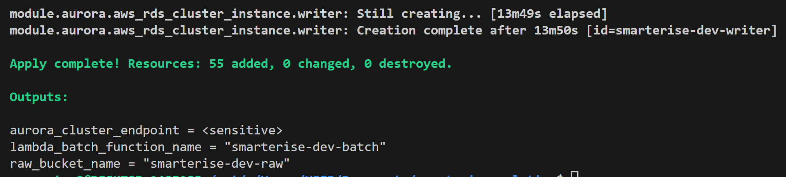


**Fresh initial loading of simulated meter readings to the raw bucket**

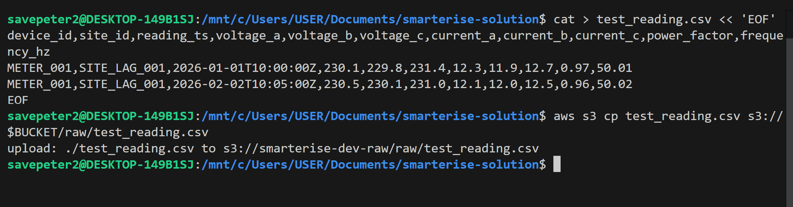


**Aurora Serverless v2 cluster provisioned - The RDS console showing the `smarterise-dev-aurora` cluster with both instances available: `smarterise-dev-reader` (writer instance, `us-east-1a`) and `smarterise-dev-writer` (reader instance, `us-east-1b`), both running Aurora PostgreSQL Serverless v2.**


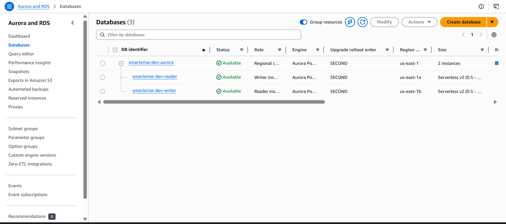


**SQS queues provisioned - The two SQS queues created by Terraform: `smarterise-dev-meter-queue` (main processing queue, SSE-SQS encrypted) and `smarterise-dev-meter-dlq` (dead-letter queue, KMS encrypted). The DLQ shows 4 messages visible - messages that failed 3 consecutive processing attempts and were moved here automatically**

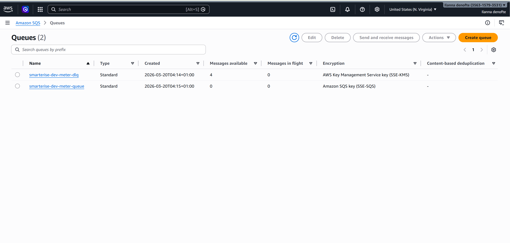


**Batch processor Lambda deployed - The `smarterise-dev-batch` Lambda function console showing the SQS trigger wired as the event source, function description, ARN, and the Monitor tab confirming CloudWatch metrics are active.**

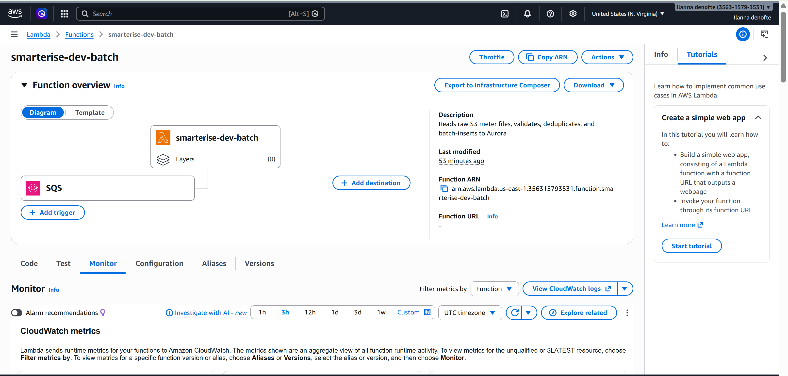

**Aurora credentials stored in Secrets Manager - The secret `smarterise/dev/aurora/master` created by Terraform, showing the secret ARN, encryption key (`aws/secretsmanager`), and description confirming it is Terraform-managed. Lambda fetches credentials from this secret at cold-start**

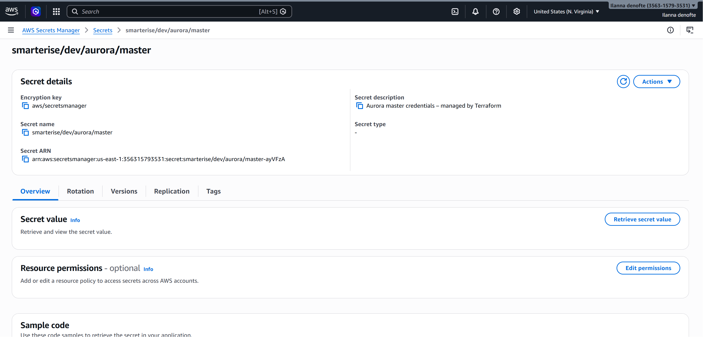


**CloudWatch log groups created with retention policy - Three log groups managed explicitly by Terraform: `/aws/lambda/smarterise-dev-batch`, `/aws/lambda/smarterise-dev-stream`, and `/aws/rds/cluster/smarterise-dev-aurora/postgresql`. Both Lambda log groups have a 1-month retention policy enforced - without Terraform managing these explicitly, logs would be retained forever at increasing cost.**

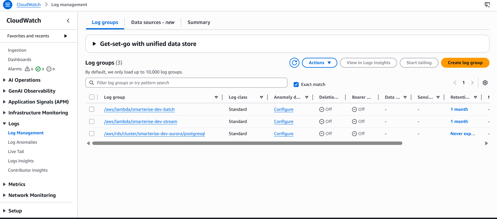


### 4.2 Database Schema Applied

The schema DDL was run once via the RDS Query Editor after the cluster was provisioned.

**Connecting to Aurora via the RDS Query Editor - The "Connect to database" dialog showing the cluster `smarterise-dev-aurora` selected, authentication via Secrets Manager ARN (`smarterise/dev/aurora/master`), and database name `smarterise_iot_dev`. This is the Data API connection used to run the schema script.**

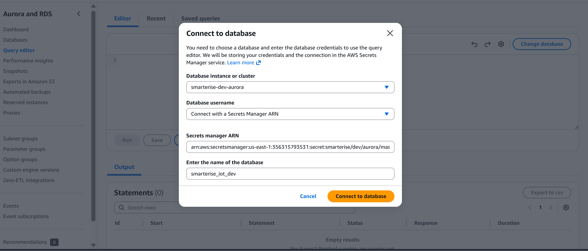

**Schema DDL loaded in the Query Editor - The full `schema.sql` script pasted into the RDS Query Editor, showing the opening DDL: `CREATE EXTENSION` statements for uuid-ossp, `pg_stat_statements`, and `pg_cron`, followed by the `site_meter_map` table definition - the single source of truth for device-to-site mapping.**

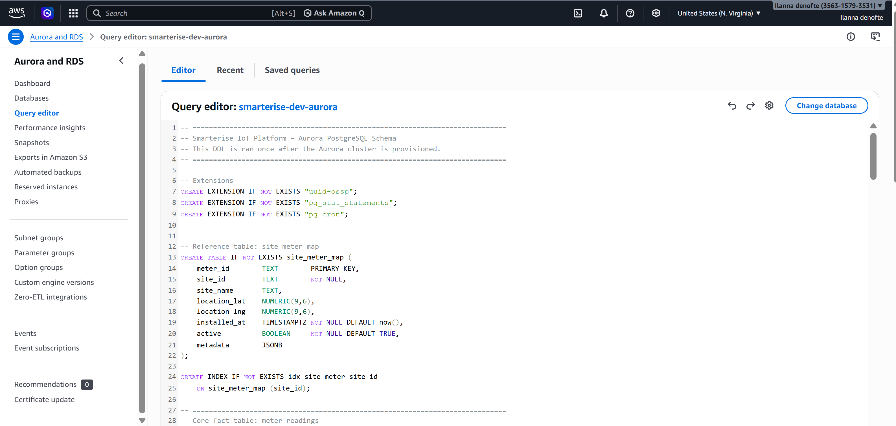

**Verifying all objects were created - `SELECT table_name FROM information_schema.tables WHERE table_schema='public'` returning 11 rows, confirming the schema applied successfully. The result set includes the partition tables, views, and system tables.**

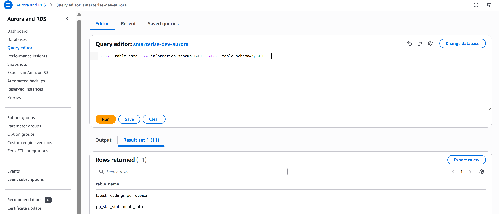


**Full list of created database objects - The complete result showing all 11 public schema objects: latest_readings_per_device (view), `pg_stat_statements_info`, `pg_stat_statements`, `site_meter_map`, `meter_readings` (parent partitioned table), and monthly partitions `meter_readings_2026_01` through `meter_readings_2026_06` - six months of future partitions auto-created by `create_monthly_partitions()` on schema bootstrap.**

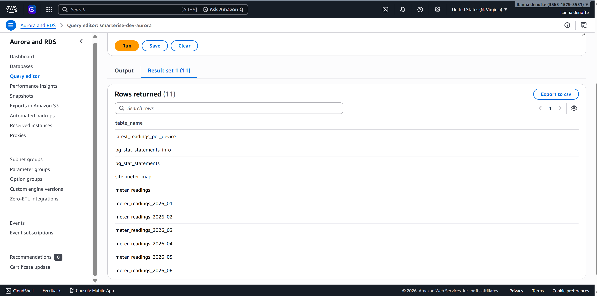


### 4.3 Pipeline Execution
A CSV file was uploaded to the S3 raw bucket, triggering the full ingestion pipeline.

**First Lambda invocation - cold start and successful insert - CloudWatch log events from the first-ever batch Lambda invocation (`/aws/lambda/smarterise-dev-batch`). The DEBUG logs show Lambda fetching credentials from Secrets Manager (GetSecretValue → HTTP 200), followed by INFO logs confirming: `Loaded environment variables and secrets successfully`, `Database connection established successfully`, and Inserted 2 rows (of 2 attempted)**.

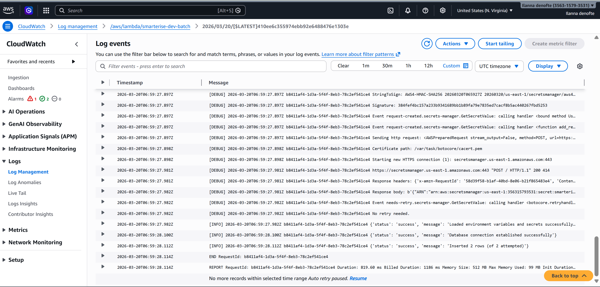

**Rows inserted into `meter_readings` after first batch - `SELECT * FROM meter_readings` returning 2 rows: `METER_001 / SITE_LAG_001` at `2026-01-01 10:00:00` and `2026-02-02 10:05:00`, with all three-phase voltage, current, power factor, and frequency columns populated as expected**.


**`latest_readings_per_device` view in action - `SELECT * FROM latest_readings_per_device` returning 1 row - the most recent reading for `METER_001` (`2026-02-02 10:05:00`). Confirms the `DISTINCT ON (device_id)` `ORDER BY reading_ts DESC` view logic is working correctly, returning only the latest reading per meter regardless of how many rows exist**.

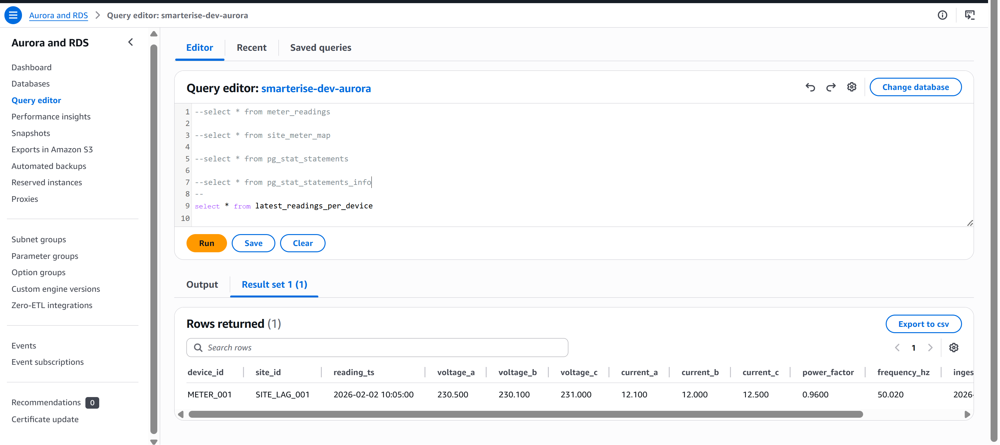


**CloudWatch logs from a subsequent Lambda invocation after uploading a second CSV batch. The same pattern: Secrets Manager fetch (warm invocations will skip this), connection established, then `Inserted 2 rows (of 3 attempted)` - the 1 skipped row hit the `ON CONFLICT DO NOTHING` clause, confirming the deduplication constraint is functioning correctly**. 


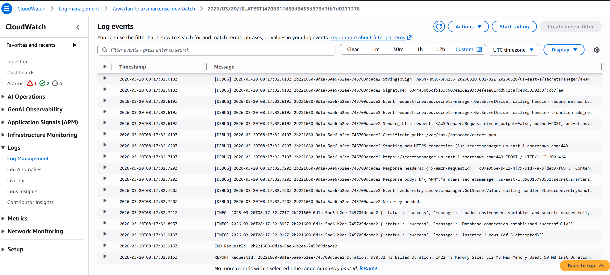 

**`meter_readings` table after second batch load - `SELECT * FROM meter_readings` now returning 4 rows, showing data from 3 different meters across 2 sites: `METER_001` (2 readings, `SITE_LAG_001`), `METER_002` (1 reading, `SITE_LAG_001`), and `METER_003` (1 reading, SITE_LAG_002). The row IDs jump from 2 to 9 and 10 - consistent with the skipped duplicate from the previous batch having occupied IDs 3–8 in the sequence before being rolled back**.

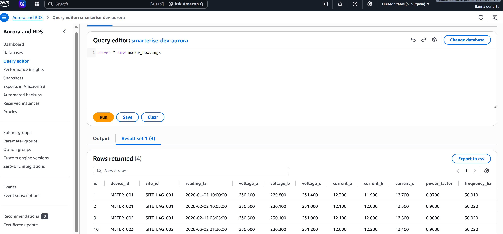


---

## 5. Architecture Evolution and Operational Notes

### Writing Processed Records to the Processed S3 Bucket

The processed S3 bucket (`smarterise-dev-processed`) is already provisioned. After successful Aurora insertion, Lambda can write the validated and deduplicated records to this bucket in Parquet format, partitioned by `site_id` and `reading_ts` date. This enables Amazon Athena to run ad-hoc analytical queries directly against S3 at a fraction of the cost of Aurora, without touching the operational database. This is particularly useful for data science teams running exploratory analysis or backfill jobs.

### Adding a New Site or Meter

1. Insert a row into `site_meter_map` with the new `meter_id`, `site_id`, and site metadata.
2. No Lambda code change is required - the site-to-meter mapping now lives in the database, not in application code. The Lambda handler reads `site_id` directly from the incoming CSV or MQTT payload.

### Scaling to 500+ Sites

- Raise `reserved_concurrent_executions` on the batch Lambda in `terraform.tfvars` - the formula is approximately one concurrent execution per 10 simultaneous SQS pollers.
- Add Aurora read replicas if dashboard query latency increases under higher concurrent read load.
- Consider adding **RDS Proxy** in front of the Aurora writer if Lambda concurrency is raised above 50 - RDS Proxy multiplexes connections and pins the Aurora connection count to a configurable pool size regardless of Lambda concurrency.
- Consider composite partitioning on both `site_id` and `reading_ts` if single-site queries begin scanning too many rows within a monthly partition.

### Refreshing the Materialised View

Schedule via `pg_cron` (already configured in the schema) or EventBridge → Lambda:

```sql
REFRESH MATERIALIZED VIEW CONCURRENTLY hourly_site_aggregates;
```

`CONCURRENTLY` allows read queries to continue against the existing view data without any locking during the refresh. The view should be refreshed on a cadence that matches the acceptable staleness for your dashboard - every 10 minutes is a reasonable default for an energy monitoring context.

### Partition Maintenance

Monthly partitions are created automatically by `create_monthly_partitions()`, scheduled daily at 00:05 UTC by `pg_cron`. The procedure pre-creates 3 months of future partitions and is idempotent - running it manually at any time is safe. Old partitions beyond the 24-month retention window are dropped automatically by `drop_old_partitions()`, scheduled on the 1st of each month. Both retention windows are configurable by changing the procedure arguments in the `pg_cron` schedule without any schema migration.